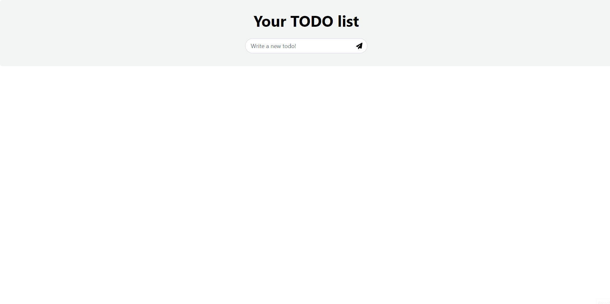

# todo-axum-askama-htmx
Sample application with:
- Backend: axum, sqlite and askama
- Frontend: HTMX and TailwindCSS



## Run

You need to have [rust](https://www.rust-lang.org/) installed.

```bash
export DATABASE_URL=sqlite://./todos.sqlite
cargo run
```

## Development

You need to have completed the previous steps and also have [node](https://nodejs.org/en/download) installed:

```bash
# For tailwind hot reload
npm i -D tailwindcss
npm run dev
```

```bash
# For the http server hot reload
# Remember have your DATABASE_URL exported
cargo install cargo-watch
cargo watch -x run -w templates -w src -w assets
```

## Production

To have a production tailwind bundle

`npm run prod`

To have a production ready web server:

`cargo build --release`

You will need to keep the `assets` and `templates` folders relative to the binary generated:

```
.
├── assets
│   ├── css
│   │   └── main.css
│   ├── favicon.ico
│   └── js
│       ├── fontawesome.js
│       ├── htmx.org@1.9.5_dist_htmx.min.js
│       └── hyperscript.org@0.9.11_dist__hyperscript.min.js
├── todosdb.sqlite
└── todox
```

## Rebuild database

In case you want to rebuild the sqlite database based on your `DATABASE_URL` env:
You need to have `libssl-dev` on Ubuntu or `openssl-devel` on Fedora installed.

```bash
cargo install sqlx-cli
cargo sqlx database create
cargo sqlx migrate run
```
